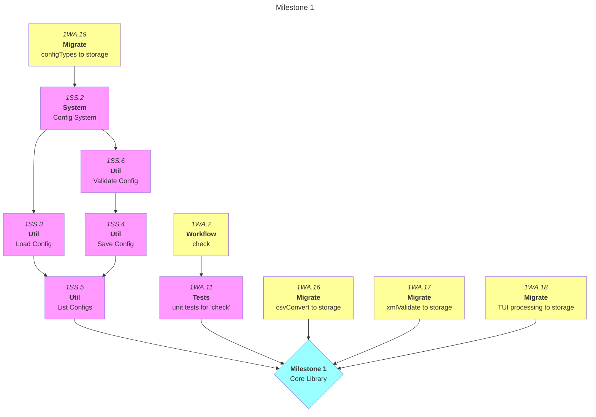
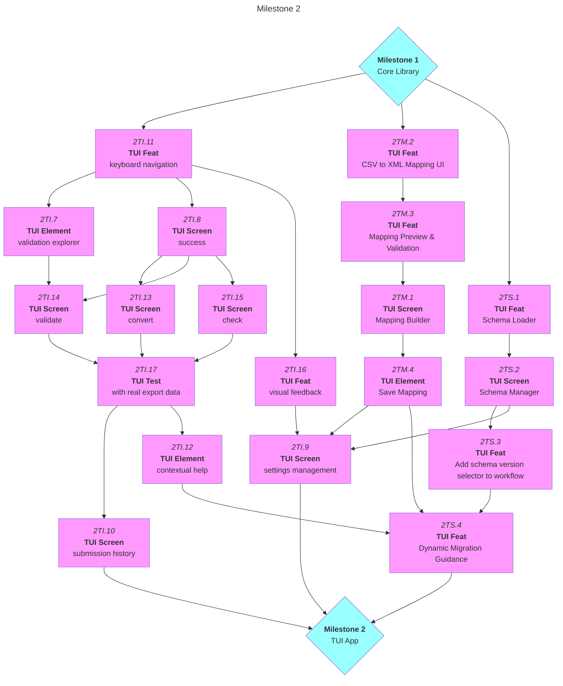
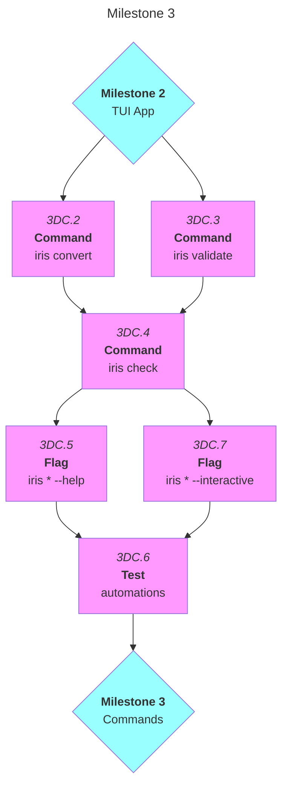
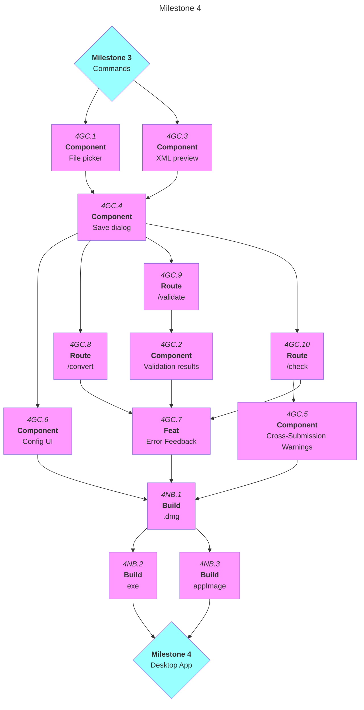
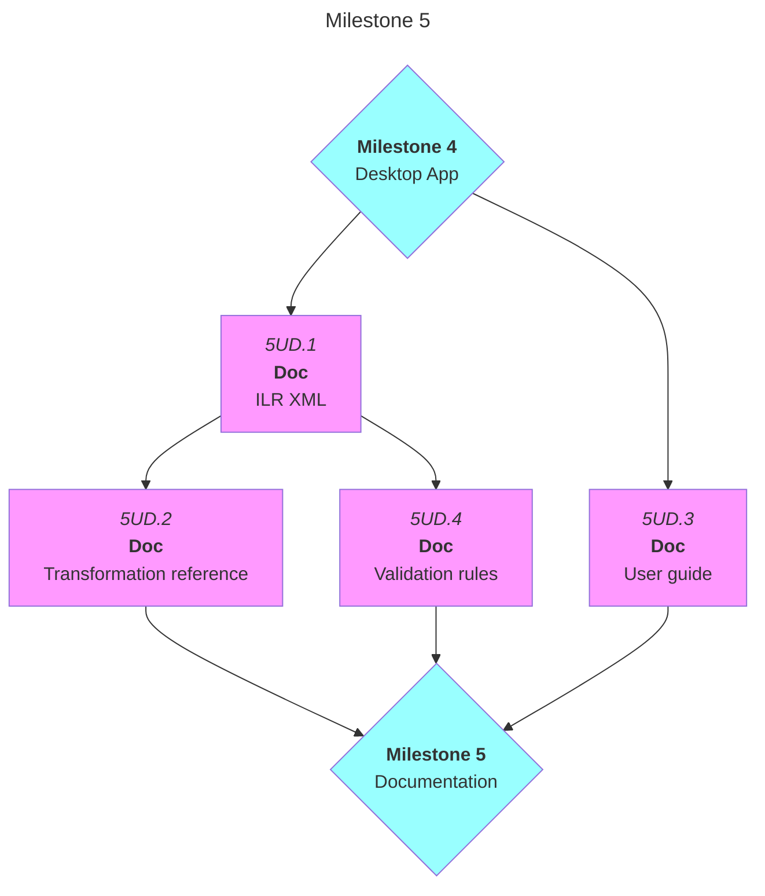

```mermaid
---
title: Tasks
---
graph TD

%% Milestone 1 %%
	1SS.2["`*1SS.2*<br/>**System**<br/>Config System`"] --> 1SS.3 & 1SS.6
	1SS.6["`*1SS.6*<br/>**Util**<br/>Validate Config`"] --> 1SS.4
	1SS.4["`*1SS.4*<br/>**Util**<br/>Save Config`"] --> 1SS.5
	1SS.3["`*1SS.3*<br/>**Util**<br/>Load Config`"] --> 1SS.5
	1SS.5["`*1SS.5*<br/>**Util**<br/>List Configs`"]

	1WA.7["`*1WA.7*<br/>**Workflow**<br/>check`"]:::open --> 1WA.11
	1WA.11["`*1WA.11*<br/>**Tests**<br/>unit tests for 'check'`"]

	1WA.16["`*1WA.16*<br/>**Migrate**<br/>csvConvert to storage`"]:::open
	1WA.17["`*1WA.17*<br/>**Migrate**<br/>xmlValidate to storage`"]:::open
	1WA.18["`*1WA.18*<br/>**Migrate**<br/>TUI processing to storage`"]:::open
	1WA.19["`*1WA.19*<br/>**Migrate**<br/>configTypes to storage`"]:::open

	1SS.5 & 1WA.11 & 1WA.16 & 1WA.17 & 1WA.18 --> m1{"`**Milestone 1**<br/>Core Library`"}:::mile

%% Milestone 2 %%
	2TM.2["`*2TM.2*<br/>**TUI Feat**<br/>CSV to XML Mapping UI`"] --> 2TM.3
	2TM.3["`*2TM.3*<br/>**TUI Feat**<br/>Mapping Preview & Validation`"] --> 2TM.1
	2TM.1["`*2TM.1*<br/>**TUI Screen**<br/>Mapping Builder`"] --> 2TM.4
	2TM.4["`*2TM.4*<br/>**TUI Element**<br/>Save Mapping`"] --> 2TI.9 & 2TS.4
	
	2TS.1["`*2TS.1*<br/>**TUI Feat**<br/>Schema Loader`"] --> 2TS.2
	2TS.2["`*2TS.2*<br/>**TUI Screen**<br/>Schema Manager`"] --> 2TS.3 & 2TI.9
	2TS.3["`*2TS.3*<br/>**TUI Feat**<br/>Add schema version selector to workflow`"] --> 2TS.4
	2TS.4["`*2TS.4*<br/>**TUI Feat**<br/>Dynamic Migration Guidance`"]
	
	2TI.7["`*2TI.7*<br/>**TUI Element**<br/>validation explorer`"] --> 2TI.14
	2TI.8["`*2TI.8*<br/>**TUI Screen**<br/>success`"] --> 2TI.13 & 2TI.14 & 2TI.15
	2TI.9["`*2TI.9*<br/>**TUI Screen**<br/>settings management`"]
	2TI.10["`*2TI.10*<br/>**TUI Screen**<br/>submission history`"]
	2TI.11["`*2TI.11*<br/>**TUI Feat**<br/>keyboard navigation`"] --> 2TI.7 & 2TI.8 & 2TI.16
	2TI.12["`*2TI.12*<br/>**TUI Element**<br/>contextual help`"] --> 2TS.4
	2TI.13["`*2TI.13*<br/>**TUI Screen**<br/>convert`"] --> 2TI.17
	2TI.14["`*2TI.14*<br/>**TUI Screen**<br/>validate`"] --> 2TI.17
	2TI.15["`*2TI.15*<br/>**TUI Screen**<br/>check`"] --> 2TI.17
	2TI.16["`*2TI.16*<br/>**TUI Feat**<br/>visual feedback`"] --> 2TI.9
	2TI.17["`*2TI.17*<br/>**TUI Test**<br/>with real export data`"] --> 2TI.10 & 2TI.12
	
	2TI.9 & 2TI.10 & 2TS.4 --> m2{"`**Milestone 2**<br/>TUI App`"}:::mile

%% Milestone 3 %%
	3DC.2["`*3DC.2*<br/>**Command**<br/>iris convert`"] --> 3DC.4
	3DC.3["`*3DC.3*<br/>**Command**<br/>iris validate`"] --> 3DC.4
	3DC.4["`*3DC.4*<br/>**Command**<br/>iris check`"] --> 3DC.5 & 3DC.7
	3DC.5["`*3DC.5*<br/>**Flag**<br/>iris * --help`"] --> 3DC.6
	3DC.6["`*3DC.6*<br/>**Test**<br/>automations`"]
	3DC.7["`*3DC.7*<br/>**Flag**<br/>iris * --interactive`"] --> 3DC.6
	
	3DC.6 --> m3{"`**Milestone 3**<br/>Commands`"}:::mile

%% Milestone 4 %%
	4GC.1["`*4GC.1*<br/>**Component**<br/>File picker`"] --> 4GC.4
	4GC.2["`*4GC.2*<br/>**Component**<br/>Validation results`"] --> 4GC.7
	4GC.3["`*4GC.3*<br/>**Component**<br/>XML preview`"] --> 4GC.4
	4GC.4["`*4GC.4*<br/>**Component**<br/>Save dialog`"] --> 4GC.6 & 4GC.8 & 4GC.9 & 4GC.10
	4GC.5["`*4GC.5*<br/>**Component**<br/>Cross-Submission Warnings`"] --> 4NB.1
	4GC.6["`*4GC.6*<br/>**Component**<br/>Config UI`"] --> 4NB.1
	4GC.7["`*4GC.7*<br/>**Feat**<br/>Error Feedback`"] --> 4NB.1
	4GC.8["`*4GC.8*<br/>**Route**<br/>/convert`"] --> 4GC.7
	4GC.9["`*4GC.9*<br/>**Route**<br/>/validate`"] --> 4GC.2
	4GC.10["`*4GC.10*<br/>**Route**<br/>/check`"] --> 4GC.5 & 4GC.7
	
	4NB.1["`*4NB.1*<br/>**Build**<br/>.dmg`"] --> 4NB.2 & 4NB.3
	4NB.2["`*4NB.2*<br/>**Build**<br/>exe`"]
	4NB.3["`*4NB.3*<br/>**Build**<br/>appImage`"]
	
	4NB.2 & 4NB.3 --> m4{"`**Milestone 4**<br/>Desktop App`"}:::mile

%% Milestone 5 %%
	5UD.1["`*5UD.1*<br/>**Doc**<br/>ILR XML`"] --> 5UD.2 & 5UD.4
	5UD.2["`*5UD.2*<br/>**Doc**<br/>Transformation reference`"]
	5UD.3["`*5UD.3*<br/>**Doc**<br/>User guide`"]
	5UD.4["`*5UD.4*<br/>**Doc**<br/>Validation rules`"]
	
	5UD.2 & 5UD.3 & 5UD.4 --> m5{"`**Milestone 5**<br/>Documentation`"}:::mile

m1 --> 2TI.11 & 2TM.2 & 2TS.1
m2 --> 3DC.2 & 3DC.3
m3 --> 4GC.1 & 4GC.3
m4 --> 5UD.1 & 5UD.3

classDef default,blocked fill:#f9f;
classDef open fill:#ff9;
classDef mile fill:#9ff;
```

# Iris: MVP

|          | Status                                      | Next Up                               | Blocked                               |
| -------- | ------------------------------------------- | ------------------------------------- | ------------------------------------- |
| **Core** | Storage abstraction complete                | workflow migrations; config system    | config system (needs 1WA.19)          |
| **CLI**  | TUI launches                                | direct commands (convert, validate)   | `iris check` (needs 1WA.7)            |
| **TUI**  | Basic screens & navigation                  | validation explorer; convert workflow | cross-check workflow (needs 1WA.7)    |
| **GUI**  | SvelteKit configured                        | (awaiting TUI workflows)              | all functionality (needs M2 complete) |

---

## Contents

- [Milestones](#milestones)
  - [Milestone 1: Shared Core Library](#m1)
  - [Milestone 2: TUI Interface](#m2)
  - [Milestone 3: Direct Commands](#m3)
  - [Milestone 4: Desktop Interface](#m4)
  - [Milestone 5: Production Ready](#m5)
- [Progress Map](#map)
- [Links](#links)
- [Beyond MVP](#post-mvp)

---

<a name="milestones"><h2>Milestones</h2></a>

Format: {Milestone}{Category}.{Seq} — alternating number-alpha-number

- Examples: 1C.1, 1SC.15, 2T.6, 2MB.3, 3D.1
- Sub-tasks: 2T.3a, 2T.3b (alpha suffix)
- Additions: append next number in category. No renumbering.

<a name="m1"><h3>Milestone 1: Shared Core Library</h3></a>

> [!IMPORTANT]
> **Goal:** Working transformation engine used by both interfaces

> [!NOTE]
> **Key**
> - CL (base utils)
> - SG (schema system)
> - SS (schema/mapping storage)
> - WA (workflow abstractions)

<a name="m1-doing"><h4>In Progress (Milestone 1)</h4></a>

<a name="m1-todo"><h4>To Do (Milestone 1)</h4></a>

- [ ] 1WA.7. Implement `check` workflow (load XML → load XML/history → compare → print report)
- [ ] 1WA.16. Migrate `csvConvert` workflow to use storage (replace Bun.write + .keep hack)
- [ ] 1WA.17. Migrate `xmlValidate` workflow to use storage (replace readFileSync)
- [ ] 1WA.18. Migrate TUI processing screen to use storage for schema loading
- [ ] 1WA.19. Migrate `configTypes.ts` to use storage (replace hardcoded defaults)

<a name="m1-blocked"><h4>Blocked (Milestone 1)</h4></a>

- [ ] 1SS.2. Configuration system (user preferences + custom field mappings in `~/.iris/config.json`) — **depends on 1WA.19**
- [ ] 1SS.3. Load mapping config from file (read JSON, validate structure) — **depends on 1SS.2**
- [ ] 1SS.4. Save mapping config to file (write JSON, handle errors) — **depends on 1SS.6**
- [ ] 1SS.5. List available mapping configs (scan `~/.iris/mappings/` directory) — **depends on 1SS.3, 1SS.4**
- [ ] 1SS.6. Validate mapping config against active schema (verify XSD paths exist) — **depends on 1SS.2**
- [ ] 1WA.11. Add unit tests for `check` (independent of UI) — **depends on 1WA.7**

<a name="m1-done"><h4>Completed (Milestone 1)</h4></a>

- [x] 1SS.1. Implement storage abstractions for cross-submission history (supports config, mappings, schemas, submissions, history)
- [x] 1CL.1. Implement CSV parser with header-based column matching
- [x] 1CL.2. Create ILR XML generator (minimal valid structure)
- [x] 1CL.3. Build semantic validator (beyond structural checks)
- [x] 1CL.4. Create XML parser module (src/lib/xml-parser.ts)
	- [x] 1CL.4a. Add XML parser library (fast-xml-parser or equivalent)
- [x] 1CL.5. Add unit tests for core transformations
- [x] 1SG.1. Implement **Dynamic Schema (Phase 1): XSD Parser & Schema Registry**
	- [x] 1SG.1a. Create schema type definitions (SchemaElement, SchemaConstraints, SchemaRegistry)
	- [x] 1SG.1b. Add fast-xml-parser dependency
	- [x] 1SG.1c. Implement XSD parser (parse XSD as XML, extract element definitions)
	- [x] 1SG.1d. Implement schema registry builder (transform XSD tree into queryable registry)
	- [x] 1SG.1e. Add tests against actual schemafile25.xsd
- [x] 1SG.2. Implement **Dynamic Schema (Phase 2): Schema-Driven Validator**
	- [x] 1SG.2a. Create schema validator module (validates data against registry constraints)
	- [x] 1SG.2b. Implement constraint validation (pattern, length, range, cardinality, enumeration)
	- [x] 1SG.2c. Migrate existing validator to use schema registry (remove hardcoded REQUIRED_FIELDS)
- [x] 1SG.3. Implement **Dynamic Schema (Phase 3): Schema-Driven Generator**
	- [x] 1SG.3a. Create schema generator module (generate XML by traversing registry)
	- [x] 1SG.3b. Implement element ordering from xs:sequence
	- [x] 1SG.3c. Migrate existing generator to use schema registry (remove hardcoded interfaces)
- [x] 1SG.4. Implement **Dynamic Schema (Phase 4): Column Mapping Configuration**
	- [x] 1SG.4a. Create column mapper module (CSV column → XSD path mapping)
	- [x] 1SG.4b. Define mapping configuration schema (ColumnMapping, MappingConfig types)
	- [x] 1SG.4c. Create default FaC Airtable mapping configuration
	- [x] 1SG.4d. Migrate convert workflow to use column mapper (remove hardcoded rowToLearner/rowToDelivery)
- [x] 1WA.1. Define workflow step interfaces (types, status, data, errors)
- [x] 1WA.2. Create workflow abstraction consumption layer (interface-agnostic generators)
- [x] 1WA.3. Implement `validateCsv` workflow (load CSV → parse CSV → validate CSV → print report)
- [x] 1WA.4. Implement `convertCsv` workflow (load CSV parse → validate CSV → generate XML → save XML)
- [x] 1WA.5. Implement `validateXml` workflow (load/generate XML → parse XML → validate XML → print report)
- [x] 1WA.8. Add unit tests for `validateCsv` (independent of UI)
- [x] 1WA.9. Add unit tests for `convertCsv` (independent of UI)
- [x] 1WA.10. Add unit tests for `validateXml` (independent of UI)
- [x] 1WA.12. Add round-trip tests (load CSV → validate CSV → create XML → validate XML → passes)
- [x] 1WA.14. Add helper to consume workflow generator and capture return value in single pass
- [x] 1WA.15. Add mapping config parameter to `convertCsv` workflow (select which mapping to use)
- [x] 1WA.13. Refactor workflow to yield step copies (prevent reference mutation issues)

<h4>Milestone 1 Notes</h4>

> [!IMPORTANT]
> **XML Validation Prerequisite**
> - Milestone 1 cannot be considered complete without XML parsing and validation capabilities.
> - The transformation engine must be able to verify its own output to ensure ILR compliance.
> - See [Architecture Decision 1c1](#1c1-workflow-boundaries-csv-vs-xml-validation) for details.

> [!IMPORTANT]
> **Dynamic Schema Prerequisite**
> - Annual ESFA schema updates must not require code changes.
> - The dynamic schema system (Phases 1-4) enables loading new XSD files at runtime.
> - Phase 5 (TUI schema management) is deferred to Milestone 2.

---

<a name="m2"><h3>Milestone 2: TUI Interface (Primary)</h3></a>

> [!IMPORTANT]
> **Goal:** Beautiful, interactive terminal interface as the main user experience

> [!NOTE]
> **Key**
> - TI (TUI screens)
> - TM (mapping builder TUI)
> - TS (schema mgmt TUI)

<a name="m2-doing"><h4>In Progress (Milestone 2)</h4></a>

- [ ] 2TI.11. Implement keyboard navigation (arrows, vim-style, shortcuts)

<a name="m2-todo"><h4>To Do (Milestone 2)</h4></a>

- [ ] 2TI.7. Build validation results explorer (error/warning navigation)
- [ ] 2TI.8. Implement success/completion screen with next actions
- [ ] 2TI.12. Add help overlay system (contextual help)
- [ ] 2TI.13. Build convert workflow (file select → process → results)
- [ ] 2TI.16. Add visual feedback (animations, transitions, spinners)
- [ ] 2TI.17. Test TUI with real CSV exports from Airtable
- [ ] 2TM.2. Implement CSV column → XSD path mapping UI (interactive path selector)
- [ ] 2TM.3. Add mapping preview/validation (show which fields will map, highlight issues)
- [ ] 2TS.1. Create schema loader module (load/cache schemas from ~/.iris/schemas/)
- [ ] 2TS.2. Build schema manager TUI screen (upload, list, select active schema)

<a name="m2-blocked"><h4>Blocked (Milestone 2)</h4></a>

- [ ] 2TI.9. Add settings management screen — **depends on 2TM.4, 2TS.2, 2TI.16**
- [ ] 2TI.10. Create submission history browser — **depends on 2TI.17**
- [ ] 2TI.14. Build validate workflow (file select → validate → explore errors) — **depends on 2TI.7**
- [ ] 2TI.15. Build cross-submission check workflow — **depends on 2TI.8**
- [ ] 2TM.1. Build mapping builder screen (list available mappings, create new) — **depends on 2TM.3**
- [ ] 2TM.4. Implement mapping save dialog (name, description, set as default) — **depends on 2TM.1**
- [ ] 2TS.3. Add schema version selection to workflows — **depends on 2TS.2**
- [ ] 2TS.4. Implement migration guidance when schema changes affect existing mappings — **depends on 2TS.3, 2TM.4, 2TI.12**

<a name="m2-done"><h4>Completed (Milestone 2)</h4></a>

- [x] 2TI.1. Set up TUI libraries (terminal-kit, consola, chalk, ora, cli-table3, boxen, figures, gradient-string, listr2)
- [x] 2TI.2. Create TUI application scaffold and theme system
- [x] 2TI.3. Build dashboard with menu navigation (recent activity panel pending)
    - [x] 2TI.3a. Define screen routing and navigation architecture (Router class, screen stack, transitions)
    - [x] 2TI.3b. Implement consistent layout system (header, content, status bar, borders)
    - [x] 2TI.3c. Refactor dashboard to use layout system
- [x] 2TI.4. Implement interactive file picker for CSV selection
- [x] 2TI.5. Create processing screen with live progress and log viewer
- [x] 2TI.6. Live processing screen with progress and logs

---

<a name="m3"><h3>Milestone 3: Direct Commands (Automation)</h3></a>

> [!IMPORTANT]
> **Goal:** Scriptable commands for automation and power users

> [!NOTE]
> **Key**
> - DC (direct commands)

<a name="m3-doing"><h4>In Progress (Milestone 3)</h4></a>

<a name="m3-todo"><h4>To Do (Milestone 3)</h4></a>

- [ ] 3DC.2. Implement `iris convert <file>` (non-TUI execution with pretty output)
- [ ] 3DC.3. Implement `iris validate <file>` (non-TUI validation)

<a name="m3-blocked"><h4>Blocked (Milestone 3)</h4></a>

- [ ] 3DC.4. Implement `iris check` (non-TUI cross-submission check) — **depends on 3DC.2, 3DC.3**
- [ ] 3DC.5. Implement `iris --help` and command-specific help — **depends on 3DC.4**
- [ ] 3DC.6. Test direct commands in automation/scripting scenarios — **depends on 3DC.5, 3DC.7**
- [ ] 3DC.7. Add `--interactive` flag to launch TUI for specific workflows — **depends on 3DC.4**

<a name="m3-done"><h4>Completed (Milestone 3)</h4></a>

- [x] 3DC.1. Implement `iris` (launch TUI)

---

<a name="m4"><h3>Milestone 4: Desktop Interface</h3></a>

> [!IMPORTANT]
> **Goal:** Native cross-platform app via Tauri for users who prefer GUI over terminal

> [!NOTE]
> **Key**
> - GC (GUI base)
> - GM (schema/mapping GUI)
> - NB (native app builds)

<a name="m4-doing"><h4>In Progress (Milestone 4)</h4></a>

<a name="m4-todo"><h4>To Do (Milestone 4)</h4></a>

- [ ] 4GC.1. Create file picker UI for CSV input
- [ ] 4GC.2. Add validation results display panel
- [ ] 4GC.3. Add XML preview panel (show output before saving)
- [ ] 4GC.4. Implement output file save dialog
- [ ] 4GC.6. Add configuration UI (manage field mappings and preferences)
- [ ] 4GC.7. Add basic error handling and user feedback
- [ ] 4GC.8. Create `/convert` SvelteKit route
- [ ] 4GC.9. Create `/validate` SvelteKit route

<a name="m4-blocked"><h4>Blocked (Milestone 4)</h4></a>

- [ ] 4GC.5. Show cross-submission warnings in UI — **depends on 4GC.10**
- [ ] 4GC.10. Create `/check` SvelteKit route — **depends on 4GC.4**
- [ ] 4NB.1. Compile macOS `.app` build — **depends on 4GC.5, 4GC.6, 4GC.7**
- [ ] 4NB.2. Compile Windows `.exe` build — **depends on 4NB.1**
- [ ] 4NB.3. Compile Linux `.AppImage` build — **depends on 4NB.1**

<a name="m4-done"><h4>Completed (Milestone 4)</h4></a>

---

<a name="m5"><h3>Milestone 5: Production Ready</h3></a>

> [!IMPORTANT]
> **Goal:** Replaces existing Electron tool in production

> [!NOTE]
> **Key**
> - PR (production readiness)
> - UD (documentation)

<a name="m5-doing"><h4>In Progress (Milestone 5)</h4></a>

<a name="m5-todo"><h4>To Do (Milestone 5)</h4></a>

<a name="m5-blocked"><h4>Blocked (Milestone 5)</h4></a>

- [ ] 5UD.1. Document ILR XML structure and requirements — **depends on Milestone 4**
- [ ] 5UD.2. Create transformation logic reference (Airtable formulas → TypeScript) — **depends on 5UD.1**
- [ ] 5UD.3. Write user guide for non-technical users — **depends on Milestone 4**
- [ ] 5UD.4. Document validation rules and error messages — **depends on 5UD.1**

<a name="m5-done"><h4>Completed (Milestone 5)</h4></a>

---

<a name="post-mvp"><h2>Beyond MVP: Future Features</h2></a>

<h3>Post-Submission Error Prediction</h3>

> [!NOTE]
> - Analyse ILR XML and predict ESFA validation errors before actual submission

<table>
	<tr>
		<td></td>
		<td><strong>Primary</strong></td>
		<td><strong>Alternate</strong></td>
	</tr>
	<tr>
		<td><strong>Requirements</strong></td>
		<td><ul><li><em>Historical submission data</em></li><li><em>Actual ESFA response storage</em></li></ul></td>
		<td></td>
	</tr>
	<tr>
		<td><strong>Plan</strong></td>
		<td><em>Rule-based prediction based on past submission outcomes</em></td>
		<td><ol><li><em>Embedded agent</em></li><li><em>Customised machine learning model</em></li></ol></td>
	</tr>
	<tr>
		<td><strong>Architecture Support</strong></td>
		<td><em>Storage abstraction must handle ESFA response data (designed in Milestone 1)</em></td>
		<td></td>
	</tr>
</table>

<h3>3b. Cross-Submission Analysis</h3>

> [!NOTE]
> - Historical trend reporting (submission patterns over time)
> - Anomaly detection across submission periods
> - Statistical analysis of submission outcomes

<h3>3c. Declarative Transformation Layer</h3>

> [!NOTE]
> - Define transformation rules in JSON/YAML
> - Make business logic configurable without code changes
> - Allow FaC staff to adjust rules themselves

<h3>3d. Enhanced Validation</h3>

> [!NOTE]
> - Integration with ESFA validation API (if available)
> - More sophisticated semantic checks
> - Custom rule definitions for FaC-specific requirements

<h3>3e. Multi-Provider Support</h3>

> [!NOTE]
> - Export configuration for other training providers
> - Template system for different submission patterns
> - Shareable transformation rule sets

<h3>3f. Dynamic Schema Extensions</h3>

> [!NOTE]
> - Desktop UI for schema management (mirrors TUI functionality)
> - Schema diff viewer (compare two XSD versions)
> - Automated mapping suggestions when schema changes
> - Schema validation report export

<h3>3g. Directory Migration Helper</h3>

> [!NOTE]
> - Offer to migrate directory contents when user changes `outputDir` in settings
> - Prompt user before moving files
> - Handle errors gracefully if source files are in use

---

<a name="links"><h2>Links</h2></a>

<h3>Work Records</h3>

See [`docs/work-records/`](../work-records/) for detailed development history.

---

<a name="map"><h2>Progress Map</h2></a>

