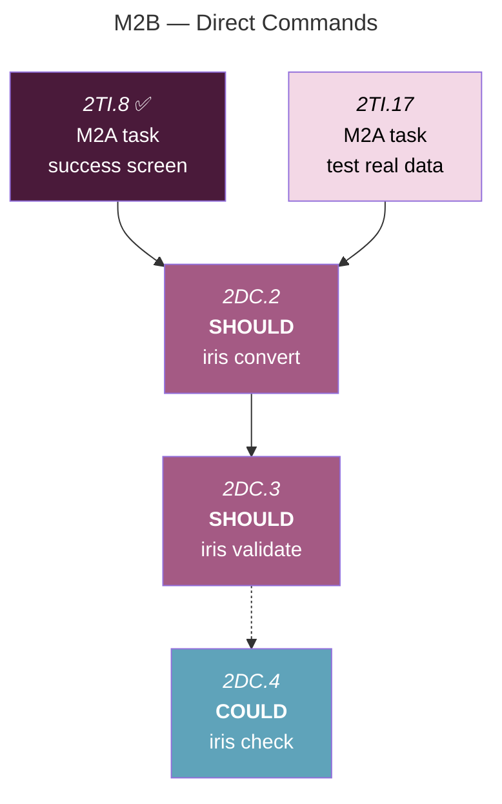
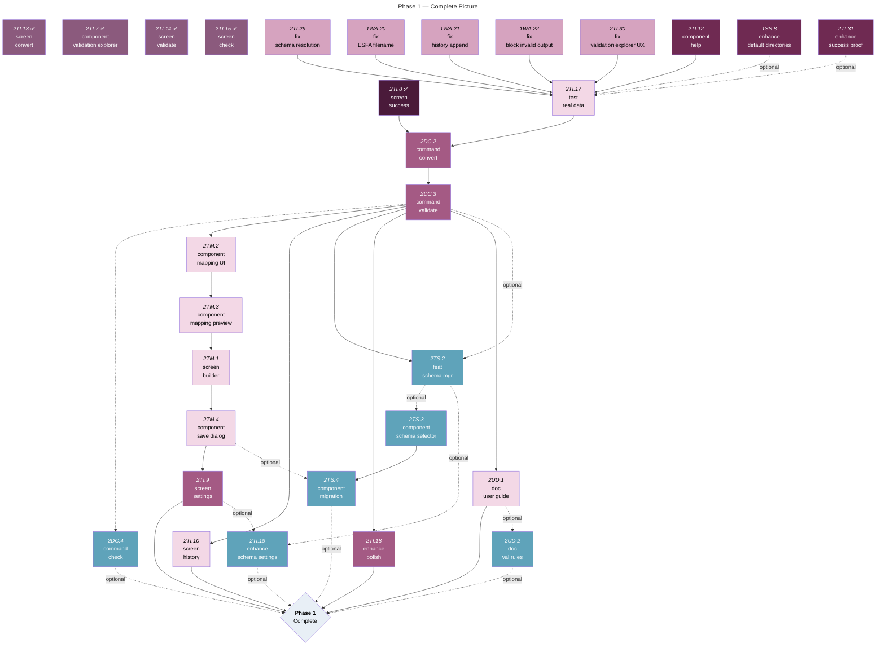

# Phase 1: MVP Features

| Sub-Milestone | Focus | Status |
|---------------|-------|--------|
| **M2A** | OpenTUI Migration + Core TUI Screens | In Progress (migration first) |
| **M2B** | Direct Commands | Blocked (depends on M2A) |
| **M2C** | Advanced TUI + Polish + Docs | Blocked (depends on M2A + M2B) |

<strong>Colour Key</strong>

- **Must** (dark/light iris purple) — Non-negotiable core functionality
- **Should** (deep purple) — Important features that enhance UX
- **Could** (teal) — Nice-to-have features that add value

**Open** (darker shade) = Ready to start | **Blocked** (lighter shade) = Awaiting dependencies

## Completed Milestones

<strong>✅ Milestone 1: Shared Core Library</strong>

> [!IMPORTANT]
> **Dynamic Schema Prerequisite**
> - Annual ESFA schema updates must not require code changes.
> - The dynamic schema system (Phases 1-4) enables loading new XSD files at runtime.
> - Phase 5 (TUI schema management) is deferred to Milestone 2.

> [!NOTE]
> **Key**
> - CL (base utils)
> - SG (schema system)
> - SS (schema/mapping storage)
> - WA (workflow abstractions)

- [x] 1CL.1. Implement CSV parser with header-based column matching
- [x] 1CL.2. Create ILR XML generator (minimal valid structure)
- [x] 1CL.3. Build semantic validator (beyond structural checks)
- [x] 1CL.4. Create XML parser module (`src/lib/xml-parser.ts`)
	- [x] 1CL.4a. Add XML parser library (fast-xml-parser or equivalent)
- [x] 1CL.5. Add unit tests for core transformations
- [x] 1SG.1. Implement **Dynamic Schema (Phase 1): XSD Parser & Schema Registry**
	- [x] 1SG.1a. Create schema type definitions (SchemaElement, SchemaConstraints, SchemaRegistry)
	- [x] 1SG.1b. Add fast-xml-parser dependency
	- [x] 1SG.1c. Implement XSD parser (parse XSD as XML, extract element definitions)
	- [x] 1SG.1d. Implement schema registry builder (transform XSD tree into queryable registry)
	- [x] 1SG.1e. Add tests against actual schemafile25.xsd
- [x] 1SG.2. Implement **Dynamic Schema (Phase 2): Schema-Driven Validator**
	- [x] 1SG.2a. Create schema validator module (validates data against registry constraints)
	- [x] 1SG.2b. Implement constraint validation (pattern, length, range, cardinality, enumeration)
	- [x] 1SG.2c. Migrate existing validator to use schema registry (remove hardcoded REQUIRED_FIELDS)
- [x] 1SG.3. Implement **Dynamic Schema (Phase 3): Schema-Driven Generator**
	- [x] 1SG.3a. Create schema generator module (generate XML by traversing registry)
	- [x] 1SG.3b. Implement element ordering from xs:sequence
	- [x] 1SG.3c. Migrate existing generator to use schema registry (remove hardcoded interfaces)
- [x] 1SG.4. Implement **Dynamic Schema (Phase 4): Column Mapping Configuration**
	- [x] 1SG.4a. Create column mapper module (CSV column → XSD path mapping)
	- [x] 1SG.4b. Define mapping configuration schema (ColumnMapping, MappingConfig types)
	- [x] 1SG.4c. Create default FaC Airtable mapping configuration
	- [x] 1SG.4d. Migrate convert workflow to use column mapper (remove hardcoded rowToLearner & rowToDelivery)
- [x] 1SS.1. Implement storage abstractions for cross-submission history (supports config, mappings, schemas, submissions, history)
- [x] 1SS.2. Configuration system (user preferences + custom field mappings in `~/.iris/config.json`)
- [x] 1SS.3. Load mapping config from file (read JSON, validate structure)
- [x] 1SS.4. Save mapping config to file (write JSON, handle errors)
- [x] 1SS.5. List available mapping configs (scan `~/.iris/mappings/` directory)
- [x] 1SS.6. Validate mapping config against active schema (verify XSD paths exist, builder paths)
- [x] 1SS.7. Document config file format and versioning (explain configVersion, mappingVersion, formatVersion, schemaVersion)
- [x] 1WA.1. Define workflow step interfaces (types, status, data, errors)
- [x] 1WA.2. Create workflow abstraction consumption layer (interface-agnostic generators)
- [x] 1WA.3. Implement `validateCsv` workflow (`load CSV → parse CSV → validate CSV → print report`)
- [x] 1WA.4. Implement `convertCsv` workflow (`load CSV parse → validate CSV → generate XML → save XML`)
- [x] 1WA.5. Implement `validateXml` workflow (`load/generate XML → parse XML → validate XML → print report`)
- [x] 1WA.7. Implement `check` workflow (`load XML → load XML or history → compare → print report`)
- [x] 1WA.8. Add unit tests for `validateCsv` (independent of UI)
- [x] 1WA.9. Add unit tests for `convertCsv` (independent of UI)
- [x] 1WA.10. Add unit tests for `validateXml` (independent of UI)
- [x] 1WA.11. Add unit tests for `check` (independent of UI)
- [x] 1WA.12. Add round-trip tests (`load CSV → validate CSV → create XML → validate XML → passes`)
- [x] 1WA.13. Refactor workflow to yield step copies (prevent reference mutation issues)
- [x] 1WA.14. Add helper to consume workflow generator and capture return value in single pass
- [x] 1WA.15. Add mapping config parameter to `convertCsv` workflow (select which mapping to use)
- [x] 1WA.16. Migrate `csvConvert` workflow to use storage (replace Bun.write + .keep hack)
- [x] 1WA.18. Migrate TUI processing screen to use storage for schema loading
- [x] 1WA.19. Migrate `configTypes.ts` to use storage (replace hardcoded defaults)
- [x] 2TI.1. Set up TUI libraries (terminal-kit, consola, chalk, ora, cli-table3, boxen, figures, gradient-string, listr2)
- [x] 2TI.2. Create TUI application scaffold and theme system
- [x] 2TI.3. Build dashboard with menu navigation (recent activity panel pending)
    - [x] 2TI.3a. Define screen routing and navigation architecture (Router class, screen stack, transitions)
    - [x] 2TI.3b. Implement consistent layout system (header, content, status bar, borders)
    - [x] 2TI.3c. Refactor dashboard to use layout system
- [x] 2TI.4. Implement interactive file picker for CSV selection
- [x] 2TI.5. Create processing screen with live progress and log viewer
- [x] 2TI.6. Live processing screen with progress and logs
- [x] 2TS.1. Create schema loader module (load/cache schemas from ~/.iris/schemas/) — exists in core lib (`storage.loadSchema()`)

---

## Open Milestones

### M2A: Core TUI Screens

<strong>✅ OpenTUI Migration (Complete)</strong>

1. Foundation ✅
	- [x] **2TI.20** — Install `@opentui/core` and `opentui-spinner` (pin exact versions, no `^`/`~`)
	- [x] **2TI.21** — Rewrite `app.ts` bootstrap (`createCliRenderer()` replaces terminal-kit fullscreen/grabInput) — **depends on 2TI.20**
	- [x] **2TI.22** — Create OpenTUI theme adapter (convert hex theme to `RGBA`; hex strings also accepted directly) — **depends on 2TI.20**
	- [x] **2TI.23** — Adapt `router.ts` for OpenTUI screen interface (screen signature changes, renderer context replaces terminal instance) — **depends on 2TI.21**
2. Screen Migration ✅
	- [x] **2TI.24** — Migrate Dashboard screen (menu → `SelectRenderable`, layout → flexbox `GroupRenderable`, gradient header retained)
	- [x] **2TI.25** — Migrate FilePicker screen (file list → `SelectRenderable` with scrolling, path breadcrumb → `TextRenderable`, manual scroll offset eliminated)
	- [x] **2TI.26** — Migrate Processing screen (step display → property-update model with auto re-render, spinner → `opentui-spinner`, no manual redraw loop)
3. Cleanup ✅
	- [x] **2TI.27** — Update documentation that still references terminal-kit; unify `app.test.ts` to use shared mock fixture — **depends on 2TI.24, 2TI.25, 2TI.26**
	- [x] **2TI.28** — (merged into 2TI.27) Update TUI test fixtures for OpenTUI mock renderer interface; verify on target terminal environments

> [!IMPORTANT]
> **Goal:** Beautiful, interactive terminal interface for core workflows

> [!NOTE]
> These tasks build **on top of the OpenTUI migration**. OpenTUI's built-in keyboard/focus system, `SelectRenderable`, `ScrollBox`, `BoxRenderable`, `ASCIIFontRenderable`, and Timeline API simplify most of these significantly compared to building them on terminal-kit.

```mermaid
---
title: M2A — Core TUI Features (post-migration)
---
graph TD

2TI.13["`*2TI.13* ✅<br/>**MUST**<br/>convert screen`"]:::must-done
2TI.7["`*2TI.7* ✅<br/>**MUST**<br/>validation explorer`"]:::must-done
2TI.14["`*2TI.14* ✅<br/>**MUST**<br/>validate screen`"]:::must-done
2TI.15["`*2TI.15* ✅<br/>**MUST**<br/>check screen`"]:::must-done
2TI.8["`*2TI.8* ✅<br/>**SHOULD**<br/>success screen`"]:::should-done

2TI.29["`*2TI.29*<br/>**MUST**<br/>fix schema resolution`"]:::must-open
1WA.20["`*1WA.20*<br/>**MUST**<br/>ESFA filename format`"]:::must-open
1WA.21["`*1WA.21*<br/>**MUST**<br/>append to history`"]:::must-open
1WA.22["`*1WA.22*<br/>**MUST**<br/>block invalid output`"]:::must-open
2TI.30["`*2TI.30*<br/>**MUST**<br/>fix validation explorer`"]:::must-open
1SS.8["`*1SS.8*<br/>**SHOULD**<br/>default directories`"]:::should-open
2TI.31["`*2TI.31*<br/>**SHOULD**<br/>success proof`"]:::should-open

2TI.29 & 1WA.20 & 1WA.21 & 1WA.22 & 2TI.30 --> 2TI.17
2TI.12["`*2TI.12*<br/>**SHOULD**<br/>contextual help`"]:::should-open --> 2TI.17
2TI.17["`*2TI.17*<br/>**MUST**<br/>test w/ real data`"]:::must-blocked

classDef must-done fill:#8B5A7D,color:#fff;
classDef must-open fill:#D6A3BF,color:#000;
classDef must-blocked fill:#F3D8E6,color:#000;
classDef should-done fill:#4A1A3A,color:#fff;
classDef should-open fill:#6F2A52,color:#fff;
classDef should-blocked fill:#A45A84,color:#fff;
classDef could-open fill:#3E7F96,color:#fff;
classDef could-blocked fill:#5FA3BA,color:#fff;
classDef mile fill:#E8EFF6,color:#000;
```

### Must Have

- [x] **2TI.11** — Implement keyboard navigation (vim-style j/k, custom shortcuts; arrow keys and focus routing handled by OpenTUI's `KeyEvent` system and `SelectRenderable`)
- [x] **2TI.13** — Build convert workflow screen (generic `WorkflowScreen` handles file select → process → results for all workflow types)
- [x] **2TI.7** — Build validation results explorer (tab-filtered issue browser with detail panel; `TabSelectRenderable` for error/warning/all, `SelectRenderable` for issue list)
- [x] **2TI.14** — Build validate workflow screen (file select → validate → explore errors; shares generic `WorkflowScreen` with convert)
- [x] **2TI.15** — Build cross-submission check workflow (file select → check → results; `CheckResultsScreen` with issue detail view)
- [ ] **2TI.29** — Fix schema resolution for global installs (`loadSchema` uses `process.cwd()` for bundled schemas — fails when `iris` run from outside project root; use `import.meta.dir` or copy schema to `~/.iris/schemas/`)
- [ ] **1WA.20** — Fix output filename to match ESFA `Filename_1` rule: `ILR-LLLLLLLL-YYYY-yyyymmdd-hhmmss-NN.XML` (currently generates `ILR-<ISO-timestamp>.xml`, missing UKPRN, academic year, serial number; all available from config). Allow user-defined naming convention in config as a `COULD`.
- [ ] **1WA.21** — Append to submission history after successful convert (`csvConvert` calls `storage.saveSubmission()` but never `storage.appendHistory()` — cross-check has no history to compare against). Also: order history by timestamp, not insertion order.
- [ ] **1WA.22** — Block convert from producing XML when validation fails (currently saves output even for completely invalid input like `hey, hey, hey`; should abort before `generate` step if error count > 0, or at minimum require user confirmation)
- [ ] **2TI.30** — Fix validation explorer UX issues:
	- Status bar says `[Tab] Switch filter` but `TabSelectRenderable` uses `[←→]` arrows
	- Tab switching causes display glitches (same bordered-container rendering issue as check-results)
	- Row numbers 0-indexed — should display as 1-indexed for non-dev users
	- Single-issue display doesn't indicate it's the first occurrence of a repeated error
- [ ] **2TI.17** — Test TUI with real CSV exports from Airtable — **depends on 2TI.29, 1WA.20, 1WA.21, 1WA.22, 2TI.30, 2TI.12**

### Should Have

- [ ] **2TI.12** — Add help overlay system (contextual help; can use OpenTUI's built-in overlay positioning) — **depends on 2TI.11**
- [x] **2TI.8** — Implement success/completion screen (generic for all workflow types; conditional "View Issues" menu, duration/output/learner count display)
- [ ] **1SS.8** — Add default input/output directory config (user preferences in `~/.iris/config.json` — avoids navigating to the same directory every session)
- [ ] **2TI.31** — Show validation proof on success screen (summary of checks passed, schema version validated against, learner count breakdown — gives user confidence the output is genuinely valid)

---

## M2B: Direct Commands

> [!IMPORTANT]
> **Goal:** Scriptable commands for automation and power users

### Should Have

- [ ] **2DC.2** — Implement `iris convert <file>` (non-TUI execution with pretty output) — **depends on 2TI.8, 2TI.17**
- [ ] **2DC.3** — Implement `iris validate <file>` (non-TUI validation) — **depends on 2DC.2**

### Could Have

- [ ] **2DC.4** — Implement `iris check` (non-TUI cross-submission check) — **depends on 2DC.3 (optional)**

---

## M2C: Advanced TUI + Polish + Docs

> [!IMPORTANT]
> **Goal:** Mapping builder, schema management, settings, and documentation
>
> **Prerequisite:** M2A + M2B must be complete

### Must Have

- [ ] **2TM.2** — Implement CSV column → XSD path mapping UI (interactive path selector; uses `SelectRenderable` for column/path lists, `InputRenderable` for search/filter) — **depends on 2DC.3**
- [ ] **2TM.3** — Add mapping preview/validation (show which fields will map, highlight issues; uses `BoxRenderable` for preview panel, `TextRenderable` for status) — **depends on 2TM.2**
- [ ] **2TM.1** — Build mapping builder screen (list available mappings, create new; uses `SelectRenderable` + `GroupRenderable` flexbox layout) — **depends on 2TM.3**
- [ ] **2TM.4** — Implement mapping save dialog (name, description, set as default; uses `InputRenderable` + `BoxRenderable`) — **depends on 2TM.1**
- [ ] **2TI.10** — Create submission history browser (uses `ScrollBox` for history list, `BoxRenderable` for detail cards) — **depends on 2DC.3**
- [ ] **2UD.1** — Write user guide for non-technical users — **depends on 2DC.3**

### Should Have

- [ ] **2TI.9** — Add settings management screen (built on OpenTUI: `SelectRenderable` for options, `InputRenderable` for values, `BoxRenderable` for sections) — **depends on 2TM.4**
- [ ] **2TI.18** — Add visual feedback (spinners via `opentui-spinner` with 80+ animations and dynamic color effects; transitions via OpenTUI Timeline API) — **depends on 2DC.3**

### Could Have

- [ ] **2TS.2** — Build schema manager TUI screen (upload, list, select active schema; uses `SelectRenderable` + `ScrollBox`) — **depends on 2DC.3 (optional)**
- [ ] **2TS.3** — Add schema version selection to workflows — **depends on 2TS.2 (optional)**
- [ ] **2TS.4** — Implement migration guidance when schema changes affect existing mappings — **depends on 2TS.3, 2TM.4 (optional)**
- [ ] **2TI.19** — Add schema management settings to settings screen — **depends on 2TS.2, 2TI.9 (optional)**
- [ ] **2UD.2** — Document validation rules and error messages — **depends on 2UD.1 (optional)**

---

## Phase 1 Progress Map

---

**Next:** [Phase 2: Production Features](./phase-2-production-features.md)
