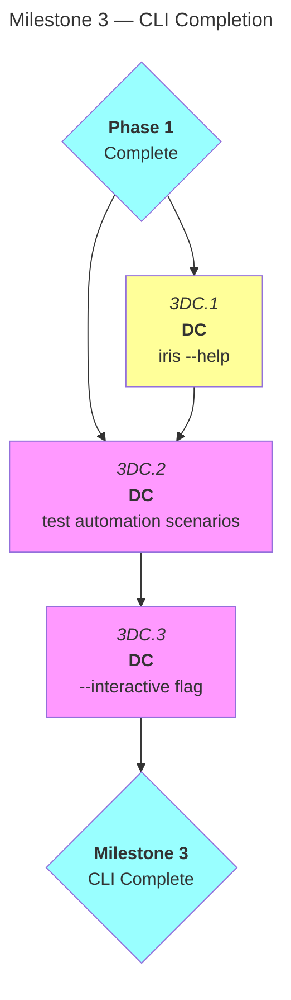
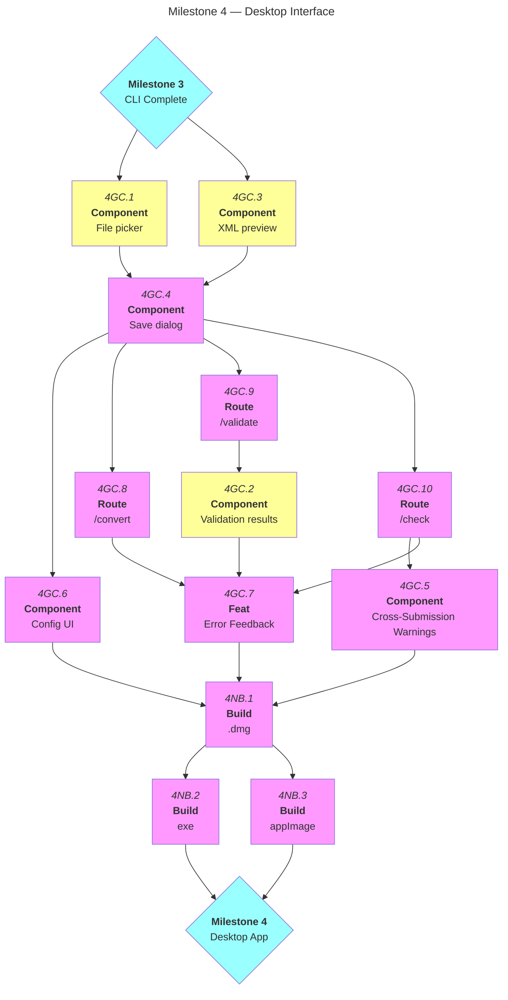
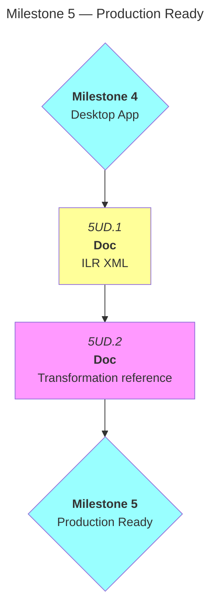
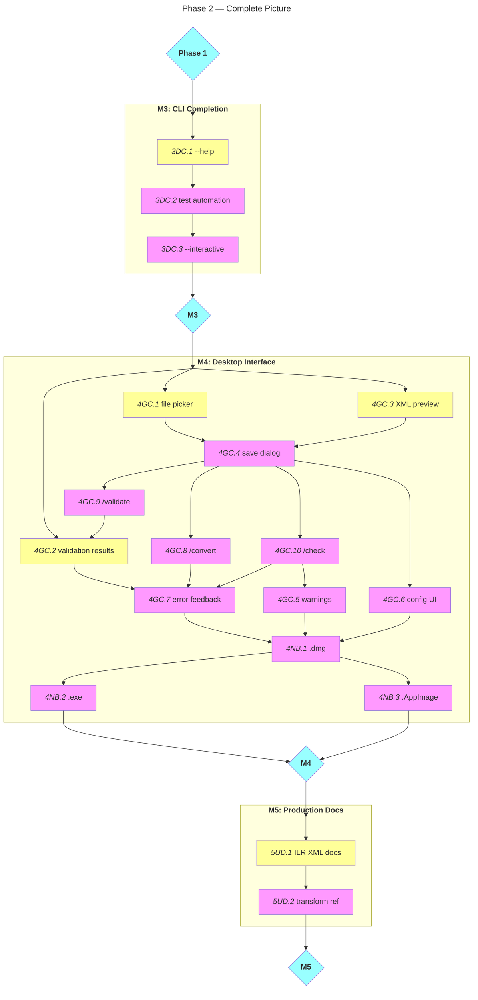

# Phase 2: Production Features

| Milestone | Focus | Status |
|-----------|-------|--------|
| **M3** | CLI Completion | Blocked (depends on Phase 1) |
| **M4** | Desktop Interface | Blocked (depends on M3) |
| **M5** | Production Docs | Blocked (depends on M4) |

**Prerequisite:** [Phase 1: MVP Features](./phase-1-mvp-features.md) — All M2A, M2B, M2C tasks complete

---

## Colour Key

```mermaid
classDef must-open fill:#D6A3BF,color:#000;
classDef must-blocked fill:#F3D8E6,color:#000;
classDef should-open fill:#6F2A52,color:#fff;
classDef should-blocked fill:#A45A84,color:#fff;
classDef could-open fill:#3E7F96,color:#fff;
classDef could-blocked fill:#5FA3BA,color:#fff;
classDef mile fill:#E8EFF6,color:#000;
```

- **Must** (dark/light iris purple) — Non-negotiable core functionality
- **Should** (deep purple) — Important features that enhance UX
- **Could** (teal) — Nice-to-have features that add value

**Open** (darker shade) = Ready to start | **Blocked** (lighter shade) = Awaiting dependencies

---

## M3: CLI Completion

> [!IMPORTANT]
> **Goal:** Complete direct command interface with help system and automation testing

> [!NOTE]
> **Category:** DC (Direct Commands)



### To Do

- [ ] **3DC.1** — Implement `iris --help` and command-specific help
- [ ] **3DC.2** — Test direct commands in automation/scripting scenarios — **depends on 3DC.1**
- [ ] **3DC.3** — Add `--interactive` flag to launch TUI for specific workflows — **depends on 3DC.2**

---

## M4: Desktop Interface

> [!IMPORTANT]
> **Goal:** Native cross-platform app via Tauri for users who prefer GUI over terminal

> [!NOTE]
> **Categories:**
> - GC (GUI Components)
> - NB (Native Builds)



### To Do

- [ ] **4GC.1** — Create file picker UI for CSV input
- [ ] **4GC.2** — Add validation results display panel
- [ ] **4GC.3** — Add XML preview panel (show output before saving)

### Blocked

- [ ] **4GC.4** — Implement output file save dialog — **depends on 4GC.1, 4GC.3**
- [ ] **4GC.6** — Add configuration UI (manage field mappings and preferences) — **depends on 4GC.4**
- [ ] **4GC.7** — Add basic error handling and user feedback — **depends on 4GC.2**
- [ ] **4GC.8** — Create `/convert` SvelteKit route — **depends on 4GC.4**
- [ ] **4GC.9** — Create `/validate` SvelteKit route — **depends on 4GC.4**
- [ ] **4GC.10** — Create `/check` SvelteKit route — **depends on 4GC.4**
- [ ] **4GC.5** — Show cross-submission warnings in UI — **depends on 4GC.10**
- [ ] **4NB.1** — Compile macOS `.app` build — **depends on 4GC.5, 4GC.6, 4GC.7**
- [ ] **4NB.2** — Compile Windows `.exe` build — **depends on 4NB.1**
- [ ] **4NB.3** — Compile Linux `.AppImage` build — **depends on 4NB.1**

---

## M5: Production Ready

> [!IMPORTANT]
> **Goal:** Comprehensive documentation for production deployment

> [!NOTE]
> **Category:** UD (User Documentation)



### To Do

- [ ] **5UD.1** — Document ILR XML structure and requirements

### Blocked

- [ ] **5UD.2** — Create transformation logic reference (Airtable formulas → TypeScript) — **depends on 5UD.1**

---

## Phase 2 Progress Map



---

**Next:** [Phase 3: Future Features](./phase-3-future-features.md)
