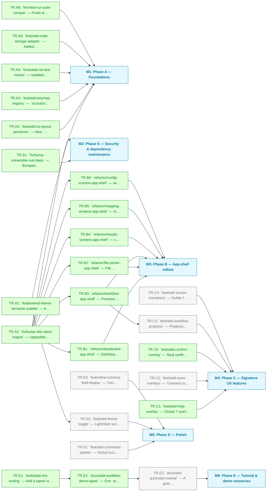

# Iris: TUI Redesign Roadmap

Take the Iris TUI from "functional" to a top-class, lazygit-class terminal application: framed panels, persistent chrome, a coherent interaction grammar, and a legible semantic colour system.

**Source analysis:** [tui-design-review.md](../../technical/tui-design-review.md)
**Design vision:** [tui-ux-design.md](../../technical/tui-ux-design.md)

Each task is a single, independently-mergeable branch (per the project's small-branch convention).

---

## Milestone 1 — Phase A — Foundations

**Goal:** Theme, layout primitives and keymap registry that the rest of the redesign builds on.

- [x] **TR.A1** — `feat/extend-theme-semantic-palette` — Add the semantic colour vocabulary (Verdant / Ember / Flare + accent tones) to `PALETTE` in `assets/brand/theme.ts`; remap success/warning/error so they read as states; fix the empty `symbols.arrows.up/down/left`; make `themeDark` a genuine dark variant on `chasm`. Update `tests/tui/theme.test.ts`.
- [x] **TR.A2** — `feat/add-tui-layout-primitives` — New `src/tui/components/` dir: `panel()` (bordered + titled box with focused/unfocused border colour) and `appShell()` (header band + content region + footer keybar). Add a spacing scale to `src/tui/utils/layout.ts`. Reuse theme + borders.
- [x] **TR.A3** — `feat/add-keymap-registry` — `src/tui/utils/keymap.ts`: declarative per-screen bindings (`{ keys, label, when?, handler }`), vim+arrow aliases, consistent globals (`?`/`q`/`ESC`/`Ctrl+C`). Drives the footer keybar. Refactor dashboard as the reference adopter.
- [x] **TR.A4** — `fix/isolate-tui-test-mocks` — Isolated bun's permanent module mocks (`bunfig.toml` `[test] root = "tests/lib"`) so mock-based TUI tests never share a runner with non-mocked ones; fixed two stale assertions and removed stray backup test files.
- [x] **TR.A5** — `feat/add-node-storage-adapter` — Added `src/lib/storage/adapters/node.ts` (Node `fs/promises`-based `StorageAdapter`) with runtime detection in `create.ts`, so vitest-run tests calling `createStorage()` work under Node, not just Bun. Merged via PR #72.
- [x] **TR.A6** — `fix/vitest-tui-suite-compat` — Fixed all 12 `tests/tui/**` suites failing to load under vitest (mock hoisting error + unresolvable `.scm`/`.wasm`/`bun:ffi` imports from `@opentui/core`) via a hand-written shared test double (`tests/fixtures/tui/opentui.ts`) and a hoisting-safe async `vi.mock` factory per suite.

---

## Milestone 2 — Phase S — Security & dependency maintenance

**Goal:** Clear open Dependabot alerts; housekeeping tracked here since this is the active roadmap.

- [x] **TR.S1** — `fix/bump-vulnerable-rust-deps` — Bumped `tauri` (2.9.5 → 2.11.5, fixes CVE-2026-42184 origin-confusion IPC bug) and ran `cargo update` for transitive crates (bytes, rand, time). `rand@0.7.3` left open (unreachable via any dependency bump). Known accepted regression: the tauri bump pins `gtk ^0.18`/`glib ^0.18` on Linux, downgrading glib from the already-patched 0.20.0 (medium-severity, non-remote NULL-pointer bug) — traded off deliberately against the remote-triggerable CVE this bump fixes.
- [x] **TR.S2** — `fix/bump-vite-vitest-majors` — Upgraded vite (`^5.0.0` → `^6.4.3`) and vitest (`^2.0.0` → `^3.2.6`), resolving 4 Dependabot alerts (1 critical, 1 high, 2 medium). Also bumped `@sveltejs/vite-plugin-svelte` for Vite 6 peer compatibility. No config changes needed.

---

## Milestone 3 — Phase B — App-shell rollout

**Goal:** Every TUI screen adopts `appShell()` + `panel()` + the keymap registry, one branch per screen cluster.

- [x] **TR.B1** — `refactor/dashboard-app-shell` — Dashboard onto shell + panels + keymap; add a Recent Activity panel sourced from submission history. Merged via PR #76. _(depends on TR.S2)_
- [x] **TR.B2** — `refactor/file-picker-app-shell` — File picker onto `appShell()` + `panel()` + Keymap, following TR.B1 as reference adopter. Border title shows the live current-directory path. All caller data contracts preserved unchanged. _(depends on TR.S2)_
- [x] **TR.B3** — `refactor/workflow-app-shell` — Processing screen into the frame (sets up TR.C3). _(depends on TR.S2)_
- [x] **TR.B4** — `refactor/results-screens-app-shell` — validation-explorer + check-results + success onto `appShell()` + `panel()` + Keymap; two-pane screens get a real focused-panel border via `panel.setFocused()`. Merged via PRs #79, #80, #81. _(depends on TR.S2)_
- [x] **TR.B5** — `refactor/mapping-screens-app-shell` — mapping-builder / -editor / -save onto `appShell()` + `panel()` + Keymap; unified the mapping-editor focus authority on the app-shell, replacing the previous weak two-panel focus model. Merged via PR #82. _(depends on TR.S2)_
  - Note: `mapping-builder.ts:340,350` and `mapping-editor.ts:557,584` still read `SelectRenderable.selectedIndex` directly (write-only on the real API, always returns `undefined`) — a latent bug found during TR.B6, flagged as an out-of-scope follow-up.
- [x] **TR.B6** — `refactor/config-screens-app-shell` — settings + history + about onto `appShell()` + `panel()` + Keymap. History gets a two-pane layout mirroring check-results. Found and fixed the `SelectRenderable.selectedIndex` read bug (write-only setter; use `getSelectedIndex()` instead). All TUI screens now on the app-shell framework — Phase B complete. _(depends on TR.S2)_

---

## Milestone 4 — Phase C — Signature UX features

**Goal:** Help overlay, toasts/confirm modal, workflow progress, and screen transitions.

- [x] **TR.C1** — `feat/add-help-overlay` — Global `?` overlay rendered from the keymap registry over a z-index layer. Keymap now owns the overlay lifecycle; new `helpOverlay()` component renders a centred panel card. Fixed a bug where `renderer.keyInput` and the focused renderable shared an `InternalKeyHandler`, letting arrow/enter keys leak through the overlay (fixed via `key.stopPropagation()`).
  - Note: Cross-referenced as `2TI.12` in the existing `phase-1-mvp-features.md` roadmap (external ID, not tracked here).
- [ ] **TR.C2** — `feat/add-toast-overlays` — Transient toasts (success/info/error).
- [ ] **TR.C3** — `feat/add-workflow-progress` — Progress bar (`progress.filled`/`empty`) + elapsed-time on `WorkflowScreen`. _(depends on TR.B3)_
- [ ] **TR.C4** — `feat/add-screen-transitions` — Subtle fade/slide on push/pop via the OpenTUI Timeline; fast, with a reduce-motion config toggle.
  - Note: Cross-referenced as `2TI.18` in the existing `phase-1-mvp-features.md` roadmap (external ID, not tracked here).
- [x] **TR.C5** — `feat/add-confirm-overlay` — Real confirm modal via `Keymap.confirm()` (y/Enter/n/Esc, promise resolution on detach); replace the double-press deletes in history & mapping-builder. Split out of the original TR.C2 (`feat/add-toast-and-confirm-overlays`) once codebase reconciliation found this half shipped but the toast half not.
  - Note: Evidence — `src/tui/components/confirmOverlay.ts` (commit `032fe4f`); wired into `history.ts` and `mapping-builder.ts` replacing the old `deleteConfirmIndex` two-press hack (commit `41ab713`), with matching test coverage.

---

## Milestone 5 — Phase D — Polish

**Goal:** Command palette, theme toggle, and refined schema field display.

- [ ] **TR.D1** — `feat/add-command-palette` — Global fuzzy jump-to-screen/action.
- [ ] **TR.D2** — `feat/add-theme-toggle` — Light/dark switch in settings, persisted to config. _(depends on TR.A1)_
- [ ] **TR.D3** — `feat/refine-schema-field-display` — Two-line + ancestor-grouped schema fields in mapping-editor.
  - Note: Cross-referenced as `2TM.5` / `2TM.6` in the existing `phase-1-mvp-features.md` roadmap (external ID, not tracked here).

---

## Milestone 6 — Phase E — Tutorial & demo resources

**Goal:** Charm VHS-scripted terminal recordings of the redesigned TUI for the README, docs, and onboarding, sequenced last so demos show the polished UI.

- [x] **TR.E1** — `build/add-vhs-tooling` — Add a `tapes/` directory, a `bun run demos` script that runs `vhs` over every `.tape`, and document the `vhs`/`ttyd`/`ffmpeg` prerequisites in the README. A reusable `tapes/_common.tape` sets width/height/font and a VHS `Set Theme` JSON mirroring the brand palette.
- [x] **TR.E2** — `docs/add-workflow-demo-tapes` — One `.tape` per core workflow driving `bun run cli`: convert, validate, cross-submission check, and the mapping builder. Render GIFs into `docs/assets/` and embed them in the README + a new `docs/tutorials/` walkthrough.
  - Note: Added `scripts/demo-env.ts` to pre-seed/restore `~/.iris/config.json` around recordings (convert gets a disposable scratch `outputDir` so it never writes into the tracked `docs/data/iris` samples). All four tapes exit via the dashboard's own `q` quit path — a raw `Ctrl+C` leaves the ttyd terminal unresponsive to further input after OpenTUI exits. Also fixed the `mapping-builder.ts` `selectedIndex` bug flagged as a follow-up in TR.B5's notes (duplicate/delete now use `getSelectedIndex()`).
- [ ] **TR.E3** — `docs/add-quickstart-tutorial` — A getting-started tutorial for non-technical users, illustrated with the TR.E2 recordings (first launch → convert → resolve issues → submit). _(depends on TR.E2)_
  - Note: Cross-referenced as `2UD.1` in the existing `phase-1-mvp-features.md` roadmap (external ID, not tracked here).

---

## Per-branch definition of done

- Conventional-commit message (KSB-relevant where applicable).
- Update/extend the relevant `tests/tui/*` suite; `bun test` green.
- Manually launch `bun run cli` and verify the change in a real terminal.
- Keep each branch a minimal tangible improvement — when in doubt, split smaller.
- For Phase E demo branches (no test suite): regenerate the affected recordings, confirm the GIFs/MP4s render, and commit the generated assets alongside their `.tape` source.

---

## Dependency Diagram

## Cross-references to existing roadmap

| This roadmap                 | Existing ID (`phase-1-mvp-features.md`) |
| ----------------------------- | ---------------------------------------- |
| TR.C1 help overlay            | 2TI.12                                   |
| TR.C4 transitions             | 2TI.18                                   |
| TR.C3 workflow progress       | 2TI.31 (validation proof) overlaps       |
| TR.D3 schema field display    | 2TM.5 / 2TM.6                            |
| TR.E3 quickstart tutorial     | 2UD.1 (user guide)                       |
